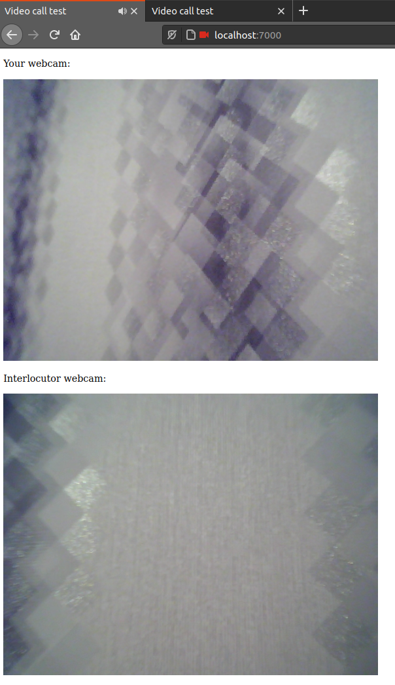
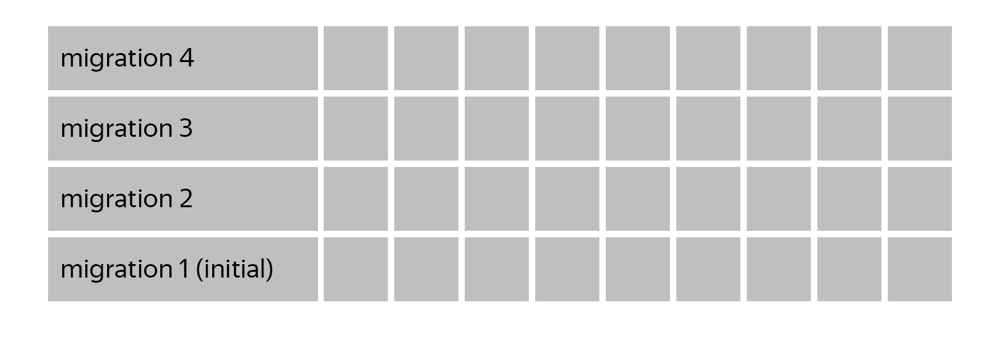

# video-call-test
[](https://coveralls.io/github/Fl1p92/video-call-test?branch=develop)

This project is the backend part of the web service, which allows making video calls between two authorized clients.
The principle of operation is similar to regular telephony: the user (caller) searches for the ID or username
of the second user (callee) and then creates a call.

The backend consists of a signaling server (helper service for WebRTC) and a classic REST server for interacting with
the frontend. The basic functionality of the billing system has been implemented: each user has his own virtual 
balance, calls are charged on the side of the caller with a per-minute payment with rounding up,
upon reaching zero balance, the ability to make calls is blocked. The ability to replenish the account is carried out 
by payments. Authorization is implemented using the jwt token.

There is a simple example of a client that allows you to check the operation of WebRTC and the signaling server,
but to implement the full functionality of the video calls web service, need to develop a client application like SPA.

Databases in the project - PostgreSQL 12.5.
The backend uses the following packages:
- `aiohttp` for asynchronous HTTP Server;
- `python-socketio` for Socket.IO server(signaling server);
- `sqlalchemy` for working with a database;
- `alembic` for managing database migrations;
- `asyncpg` as database driver (the fastest asynchronous driver for CPython);
- `aiohttp-apispec` with `marshmallow` for describe schemas tha are used for validation, serialize/deserialize data and
  generation Swagger Specification;
- `pytest` for unit testing;
- `factory-boy` for generate test data in tests;
- `flake8` for checking the code for errors and non-compliance with PEP8 standards;
- `pip-tools` for working with pip packages;
- and some others, please check out the requirements.in

## To deploy this project, complete the following steps:

### 1. Development environment configuration
Create from template and modify `.env` file
```bash
cp .env.example .env
```
Set the `SYSTEM_USER` variable for your user (run `id -u && id -g` in Unix).

### 2. Docker
To build `backend` and `client` containers and run all containers
```bash
docker-compose up -d --build
```

### 3. Run migrations
```bash
docker exec -it backend alembic upgrade head
```

## Using a simple client
Once deployed, you can use the basic client functionality to test the WebRTC technology. To do this, go to the link
http://localhost:7000/ (where 7000 is `CLIENT_PORT` environment variable). You can do this on one device by opening two
tabs in the browser, or by opening in different browsers (for this, it is desirable to have 2 audio/video sources), or 
by copying the client to another device on your local network (you do not need to run the backend there, the client 
application is enough) by setting the correct `BACKEND_IP` (IP of the first device where deployed backend) value in the
environment variables.



## Swagger Specification
In order to take advantage of the advantages of a swagger (such as auto-documentation and REST API client) 
visit the following link: http://localhost:8080/api/v1/docs/ (where 8080 is `BACKEND_PORT` environment variable).
To use most REST API points, you need a JWT token, which can be obtained from the following API point
(you must first create a user): http://localhost:8080/api/v1/auth/login/
Then you can put it in the swagger authorization interface (click the `Authorize` button or lock icon)

## Run flake8 checking
```bash
docker exec -it backend flake8
```

## Run tests with coverage
```bash
docker exec -it backend pytest -s --pdb --cov=backend --cov-report html
```

## Stairway test
This cool method for testing migrations was borrowed from [alvassin](https://github.com/alvassin/alembic-quickstart).

### Info about stairway test
Simple and efficient method to check that migration does not have typos and rolls back all schema changes. 
Does not require maintenance - you can add this test to your project once and forget about it.

In particular, test detects the data types, that were previously created by `upgrade()` method and were not removed 
by `downgrade()`: when creating a table/column, Alembic automatically creates custom data types specified in columns 
(e.g. enum), but does not delete them when deleting table or column - developer has to do it manually.

#### How it works
Test retrieves all migrations list, and for each migration executes `upgrade`, `downgrade`, `upgrade` Alembic commands.
See [test_stairway.py](backend/tests/migrations/test_stairway.py) for example.


